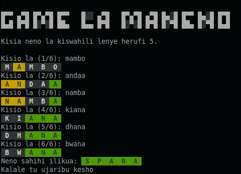
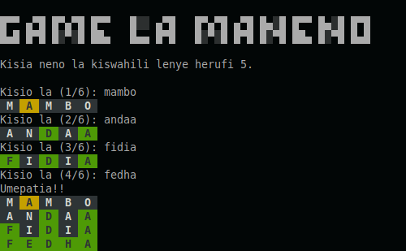

# MANENO

A swahili CLI wordle game to waste your time with.

## Screenshots

    
    

## How To Play

Try guess a five letter swahili word. There aren't any clues up front, so any five-letter word will do as an initial guess. When you type a guess, the color of each letter's box changes:
    - If it turns green, that letter is in the daily word and you've placed it in the right spot.
    - If it turns yellow, the letter is in the word but you have it in the wrong position.
    - If the box turns grey, it means the letter isn't in the word at all.

You have six tries to guess the correct word.

## How To Install

There are two ways you can play:

- You can download the game from the releases page

- If you have go installed, clone the repository and run with `go run maneno.go`

## Credits

The swahili words were stolen from [Kalebu's repository](https://github.com/Kalebu/kamusi/blob/main/words.json)

## Authors

[AvicennaJr](https://github.com/AvicennaJr)
